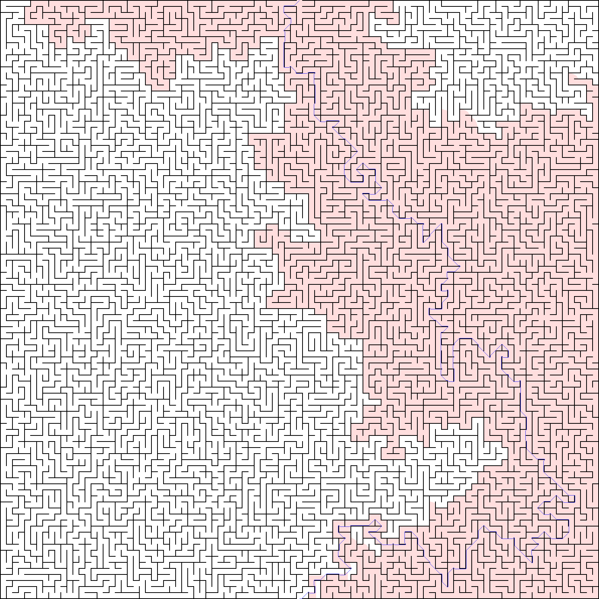

# GridAstar

This is an implementation of the A* path planning algorithm, specifically tailored for
2D rectangular grids.

It is inspired by other two open source implementations:

- [hjweide/a-star](https://github.com/hjweide/a-star)
- [daancode/a-star](https://github.com/daancode/a-star)

Nevertheless __GridAstar__ is 20% faster than the former and few orders (3>) of magnitude
faster than the latter.

To achied this speed, this library used a fairly large amount of RAM to perform many
operations in __O(1)__.

It requires between 10 and 18 bytes for each cell in the grid.

In other words, between 10 and 18 Mb of memory for a 1000x1000 gridmap.

## Usage 

```c++

    // You don't need to use this image parser, you can use your own.
    // But remember that setWorldData() requires an array where the
    // stored image is row-major and monochromatic.
    // A value of 0 (black) represents an obstacle, whilst 255 (white)
    // a free cell.
    
    Image image;
    ReadImageFromPGM("./data/maze_big.pgm", &image);

    AStar::PathFinder generator;

    generator.setWorldData( image.width, 
                            image.height, 
                            image.data.data() );
                
    AStar::Coord2D startPos(1,1);
    AStar::Coord2D targetPos(image.width-3, image.height-3);  
               
    auto path = generator.findPath(startPos, targetPos);

```


